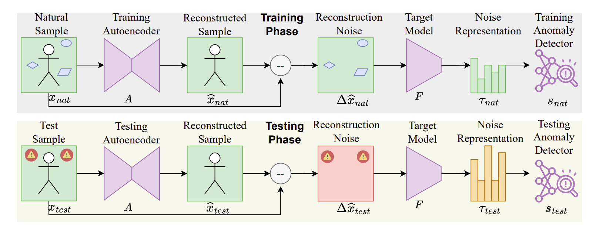

# [NoiSec-ESORICS'25] Let the Noise Speak — A Unified Defense Against Adversarial and Backdoor Attacks

[](https://arxiv.org/abs/2406.13073)  
[](LICENSE)  
<!-- []() -->

---

> **Paper**: [Let the Noise Speak: Harnessing Noise for a Unified Defense Against Adversarial and Backdoor Attacks](https://arxiv.org/abs/2406.13073)  
> **Authors**: Md Hasan Shahriar, Ning Wang, Naren Ramakrishnan, Y. Thomas Hou, Wenjing Lou
> **Accepted for publication in**: [**ESORICS 2025**](https://esorics2025.sciencesconf.org/)


---

# 🔥 Overview
**NoiSec** is a unified, attack-agnostic defense system against both **adversarial** and **backdoor** attacks. Instead of focusing on the reconstructed input, NoiSec shifts attention to the **reconstruction noise** — the underlying fingerprint of malicious manipulation and utilizes the .

<figure style="text-align: left;">
  
  <figcaption>An overview of the two implementation phases of NoiSec, illustrating the core components and implementation phases of NoiSec. It comprises three fundamental components: i) denoising autoencoder, ii) feature extractor (target model), and iii) anomaly detector. Moreover, NoiSec has two implementation phases: i) the training phase and ii) the testing phase. </figcaption>
</figure>


---

## 🧠 How It Works

1. **Input Reconstruction**: The input passes through a trained autoencoder.
2. **Noise Extraction**: Compute residual noise by subtracting reconstructed output from the input.
3. **Noise Representation**: Extract features from the noise using the target classifier.
4. **Noise Detection [Benign vs Malicious]**: Train a anomlay detector to classify the noise based on noise features.

---

## ✨ Highlights
- ✅ Reconstruction noise-based defense
- ✅ Unified detection of adversarial and backdoor attacks
- ✅ Robust agaist both white-box and black-box attacks
- ✅ Robust against adaptive attacks
- ✅ Outperforms state-of-the-art baselines

We tested it against datasets from multiple domains:
- Computer vison (Fashion-MNIST, CIFAR-10, GTSRB)
- Medical Images (Med-MNIST)
- Audio Spectrograms (Speech Command)
- Wireless Sensing (Human Activity)

---
# 🛠️ Installation

```bash
git clone https://github.com/shahriar0651/NoiSec.git
cd NoiSec
```

### Download and Install Miniconda

The command line instructions available [here](https://www.anaconda.com/docs/getting-started/miniconda/install#linux)
  will get you set up quickly with the latest Miniconda installer. 

### Create and Activate Environment
To create the virtual environment, run the following:
```bash
conda env create --file dependency/noisec_env.yaml # Create a new env
# conda env update --file dependency/noisec_env.yaml --prune # Only to update
conda activate noisec
```

# Supporing Datasets

The following datasets are used to train and test NoiSec. Each of this datasets needs to be placed in the `datasets` folder or a symlink needs to created to run this experiments. While all the datasets will be downloaded automatically in the `datasets` folder, `Activity` datasets needs to be donwloaded manually and placed in the `datasets/classification/` folder. 

| **Dataset** | **Modality** | **Input Size** | **Classes** | **Description** |**Auto Download**|
|:------------|:-------------|:---------------|:------------|:----------------|:----------------|
| [*F-MNIST*](https://github.com/zalandoresearch/fashion-mnist) | 📷 Image | 28×28×1 | 10 | BnW Images of fashion items. | Yes |
| [*CIFAR-10*](https://www.cs.toronto.edu/~kriz/cifar.html) | 📷 Image | 32×32×3 | 10 | RGB images of common objects | Yes |
| [*GTSRB*](https://benchmark.ini.rub.de/gtsrb_news.html) | 📷 Image | 32×32×3 | 43 | RGB images of traffic signs | Yes |
| [*SPEECH*](https://www.tensorflow.org/datasets/catalog/speech_commands) | 🎵 Audio | 64×81×1 | 35 | Mel-spectrogram of spoken commands | Yes |
| [*Med-MNIST*](https://medmnist.com/) | 🏥 X-rays | 64×64×1 | 2 | Chest X-rays for pediatric pneumonia | Yes |
| [*Activity*](https://github.com/ludlows/CSI-Activity-Recognition/) | 📡 Wireless | 500×90×1 | 7 | CSI of wireless sensing of human activities | No |


---

## 📂 Repository Structure

```
NoiSec/
│
├── artifacts 
│   ├── models
│   └── results
│   └── plots
├── config
│   ├── config.yaml
│   ├── dataset
│   └── models
├── datasets
├── dependency
│   └── noisec_env.yaml
├── src
│   ├── attacks
│   ├── datasets
│   ├── helper
│   ├── models
│   ├── analyze_backdoor_results.py
│   ├── analyze_adversarial_results.py
│   ├── detect_adversarial_examples.py
│   ├── detect_backdoor_examples.py
│   ├── generate_adversarial_examples.py
│   ├── run_adversarial_pipeline.py
│   ├── train_autoencoders.py
│   ├── train_classifiers.py
│   ├── nb_create_metric_table.ipynb
└── README.md
```


---
# 🚀 Run the Experiment

## Training Models (Classifier + Autoencoder)
Supporting datasets: 
- The `dataset` argument specifies one or more datasets on which to generate adversarial examples.  
  Supported datasets: `fashion`, `cifar10`, `gtsrb`, `medmnist`, `speech`, `activity`.
- For any of the following python script `dataset=<name_of_dataset>` (for instance, `dataset=fashion`) to specify on which dataset you would run the script. Additionally, you can use the hydra's `multirun` feature to run the same script for a list of dataset such as `-m dataset=fashion,cifar10,gtsrb,...>`.


### 1. Train the Classifier Model
To train the target and surrogate classifiers, run:

```bash
python train_classifiers.py # For single dataset add [dataset=dataset_name], such as [dataset=fashion] or for multiple datasets add list of datasets, such as [-m dataset=fashion,cifar10,gtsrb,medmnist,speech,activity]
```
### 2. Train the Autoencoder Model
To train the denoising autoencoder, run:

```bash
python train_autoencoders.py # For single dataset add [dataset=dataset_name], such as [dataset=fashion] or for multiple datasets add list of datasets, such as [-m dataset=fashion,cifar10,gtsrb,medmnist,speech,activity]
```

## Testing against Adversarial Attacks

The following scripts have additional arguments, particularly:
- The `blackbox` option controls whether adversarial examples are generated using the **target model** (`blackbox=False`) or the **surrogate model** (`blackbox=True`). The default is `blackbox=False`.

### 3. Generate Adversarial Examples

To generate adversarial examples for both white-box and black-box settings, run:

```bash
python generate_adversarial_examples.py # -m blackbox=False,True dataset=fashion,cifar10,gtsrb,medmnist,speech,activity
```

### 4. Detect Adversarial Examples

To detect adversarial examples for both white-box and black-box settings, run:

```bash
python detect_adversarial_examples.py # -m blackbox=False,True dataset=fashion,cifar10,gtsrb,medmnist,speech,activity
```
In this case, the `blackbox` option specifies which adversarial examples to consider during evaluation. 

### 5. Analyze Results and Create Visualizations

To analyze the results and create visualizations on the results, run:

```bash
python analyze_adversarial_results.py # -m blackbox=False,True dataset=fashion,cifar10,gtsrb,medmnist,speech,activity
```

### Optional: Running the Adversarial Attack Detection Pipeline
To run step 1 to step 5 within a single command, run:
```bash
python run_adversarial_pipeline.py # -m blackbox=False,True dataset=fashion,cifar10,gtsrb,medmnist,speech,activity
```

---
## 📊 Benchmark Results 

- The dataset specific results and plots are saved in `artifacts/results/<dataset_name>/<run_details>/data/` and `artifacts/results/<dataset_name>/<run_details>/plots/` folders.
- To create a combined results and tables for all the datasets, models, and attacks, run the nobebook: `nb_create_metric_table.ipynb` 


### Detection of Adversarial Attacks

The following table shows the AUROC scores in detecting adversarial attacks both in white-box and black-box settings across multiple attacks and datasets (along with the performance of the baselines).

| **Dataset** |**Defense**|W-Box|W-Box|W-Box|W-Box|W-Box|B-Box|B-Box|B-Box|B-Box|B-Box|
|-|-|-|-|-|-|-|-|-|-|-|-|
| | | **FGSM** | **BIM**  | **PGD**  | **UAP**  | **Square** | **FGSM** | **BIM**  | **PGD**  | **UAP**  | **Square** |
| **F-MNIST**  | MagNet | 0.68 | 0.86 | 0.85 | 0.62 | 0.92 | 0.67 | 0.75 | 0.71 | 0.59 | 0.72 |
| | Artifacts | 0.80 | 0.74 | 0.76 | 0.79 | 0.53 | 0.74 | 0.67 | 0.67 | 0.74 | 0.56 |
| | Manda  | 0.52 | 0.44 | 0.45 | 0.64 | 0.80 | 0.60 | 0.74 | 0.63 | 0.61 | 0.67 |
| | **NoiSec**   | 0.96 | 0.92 | 0.93 | 0.95 | 0.84 | 0.86 | 0.79 | 0.86 | 0.94 | 0.83 |
|-|-|-|-|-|-|-|-|-|-|-|-|
| **CIFAR-10** | MagNet | 0.63 | 0.83 | 0.83 | 0.50 | 0.35 | 0.48 | 0.50 | 0.51 | 0.51 | 0.31 |
| | Artifacts | 0.61 | 0.57 | 0.49 | 0.51 | 0.52 | 0.59 | 0.52 | 0.60 | 0.55 | 0.47 |
| | Manda  | 0.52 | 0.73 | 0.66 | 0.55 | 0.61 | 0.58 | 0.59 | 0.61 | 0.49 | 0.46 |
| | **NoiSec**   | 0.98 | 1.00 | 1.00 | 0.90 | 0.91 | 0.94 | 0.96 | 0.97 | 0.88 | 0.92 |
|-|-|-|-|-|-|-|-|-|-|-|-|
| **GTSRB** | MagNet | 0.49 | 0.62 | 0.55 | 0.72 | 0.58 | 0.53 | 0.69 | 0.71 | 0.64 | 0.50 |
| | Artifacts | 0.43 | 0.72 | 0.86 | 0.53 | 0.58 | 0.48 | 0.53 | 0.56 | 0.54 | 0.58 |
| | Manda  | 0.54 | 0.51 | 0.61 | 0.70 | 0.55 | 0.57 | 0.60 | 0.61 | 0.61 | 0.50 |
| | **NoiSec**   | 0.89 | 0.88 | 1.00 | 0.84 | 1.00 | 0.83 | 0.87 | 0.90 | 0.70 | 1.00 |
|-|-|-|-|-|-|-|-|-|-|-|-|
| **Med-MNIST**  | MagNet | 0.36 | 0.47 | 0.36 | 0.44 | 0.76 | 0.44 | 0.48 | 0.43 | 0.52 | 0.52 |
| | Artifacts | 0.56 | 0.61 | 0.53 | 0.56 | 0.76 | 0.63 | 0.54 | 0.62 | 0.53 | 0.66 |
| | Manda  | 0.41 | 0.45 | 0.37 | 0.13 | 0.79 | 0.69 | 0.60 | 0.50 | 0.32 | 0.62 |
| | **NoiSec**   | 0.90 | 0.83 | 0.98 | 0.99 | 0.91 | 0.74 | 0.67 | 0.79 | 0.80 | 0.89 |
|-|-|-|-|-|-|-|-|-|-|-|-|
| **Speech**   | MagNet | 0.70 | 0.65 | 0.55 | 0.86 | 0.92 | 0.78 | 0.86 | 0.72 | 0.43 | 0.77 |
| | Artifacts | 0.54 | 0.95 | 0.86 | 0.64 | 0.81 | 0.41 | 0.58 | 0.64 | 0.43 | 0.79 |
| | Manda  | 0.56 | 0.55 | 0.75 | 0.50 | 0.72 | 0.68 | 0.31 | 0.55 | 0.58 | 0.70 |
| | **NoiSec**   | 0.87 | 0.95 | 0.91 | 0.95 | 0.97 | 0.83 | 0.86 | 0.88 | 0.97 | 0.93 |
|-|-|-|-|-|-|-|-|-|-|-|-|
| **Activity** | MagNet | 0.74 | 0.74 | 0.76 | 0.57 | 0.73 | 0.71 | 0.70 | 0.70 | 0.77 | 0.71 |
| | Artifacts | 0.68 | 0.70 | 0.76 | 0.51 | 0.67 | 0.67 | 0.70 | 0.64 | 0.61 | 0.74 |
| | Manda  | 0.38 | 0.47 | 0.70 | 0.58 | 0.50 | 0.56 | 0.52 | 0.43 | 0.54 | 0.72 |
| | **NoiSec**   | 0.95 | 0.97 | 0.98 | 0.88 | 0.91 | 0.91 | 0.93 | 0.95 | 0.91 | 0.94 |

W-Box=White-box, B-Box=Black-box

Key findings:
- 🔒 Strong detection performance under both **white-box** and **black-box** adversarial settings.
- 📈 Maintains strong performance under **adaptive attacks** with respect to strength.


## Testing against Backdoor Attacks

Will be updated


## TO-DO:
- [ ] Share the pre-trained model weights and generated artifacts for ESORICS'25.
- [ ] Update the README for the adaptive attack evaluation.
- [ ] Share the Combined Human **Activity** dataset.

---

## 📜 Citation

Please cite if you use this repository:

```bibtex
@inproceedings{shahriar2025noisec,
  title     = {Let the Noise Speak: Harnessing Noise for a Unified Defense Against Adversarial and Backdoor Attacks},
  author    = {Shahriar, Md Hasan and Wang, Ning and Ramakrishnan, Naren and Hou, Y. Thomas and Lou, Wenjing},
  booktitle = {Proceedings of the 30th European Symposium on Research in Computer Security (ESORICS)},
  year      = {2025}
}
```

---

## 🤝 Acknowledgements

### Open-Source Contributions


This repository builds upon and is inspired by the following open-source projects:

- [Adversarial Robustness Toolbox (ART)](https://github.com/Trusted-AI/adversarial-robustness-toolbox) — for adversarial attack and defense implementations.
- [Torchattacks](https://github.com/Harry24k/adversarial-attacks-pytorch) — for adversarial attack generation in PyTorch.
- [BackdoorBox](https://github.com/ain-soph/backdoorbox) — for backdoor attack and defense implementations.
- [PyOD](https://github.com/yzhao062/pyod) — for anomaly detection implementations.

We are grateful to the developers and maintainers of these projects for advancing the research community.


### Sponsors
---
This work was supported in part by the Office of Naval Research, the National Science Foundation, and a fellowship from the Amazon-Virginia Tech Initiative for Efficient and Robust Machine Learning.

---


# License
This project is licensed under the [MIT License](LICENSE).

---

